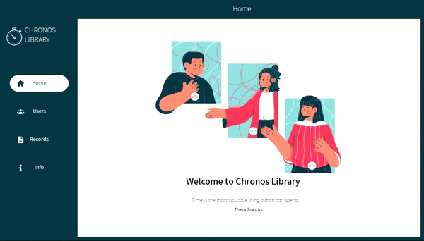

# Chronos Library
A C# application that is connected to an SQL database

## Features
- Keeps track of users in a library
- Basic CRUD Operations
- Contains a search function

## Tech Used
- C#
- SQL
- Microsoft Visual Studio